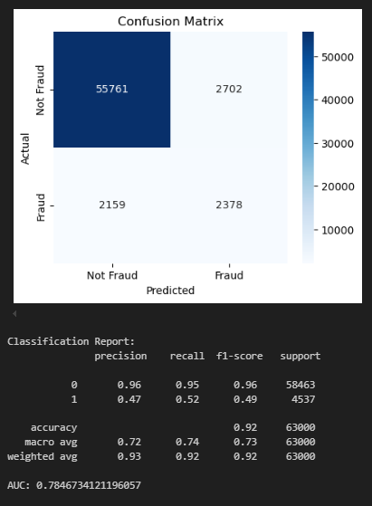

# Projekt 1 - Klasyfikacja

### Na podstawie danych *[Fraud Detection in E-Commerce Dataset](https://www.kaggle.com/datasets/kevinvagan/fraud-detection-dataset)*

Celem biznesowym modelu jest zapobieganie oszustwom w transakcjach internetowych poprzez skuteczne wykrywanie fałszywych transakcji. Model ma za zadanie automatycznie identyfikować podejrzane transakcje na podstawie dostępnych ich cech, takich jak data i godzina zakupu, metoda płatności czy długość istnienia konta w serwisie. Powinien on poprawnie identyfikować jak najwięcej oszustw, nawet kosztem fałszywych wykryć oszustw, aby jak najbardziej zabezpieczyć kupujących przed utratą pieniędzy.

Model tworzony jest przede wszystkim dla właścicieli internetowych platform sprzedażowych, którzy dysponując wszystkimi niezbędnymi danymi o transkacji są w stanie na wczesnym etapie zablokować próby oszustw. Oczywiście musi się to wiązać ze współpracą z bankami, aby po odnotowanej próbie oszustwa na konkretnej witrynie bank całkowicie zablokował możliwość posługiwania się danym środkiem płatniczym przypisanym do konta, z którego próbowano dokonać oszustwa.

Jako główną metrykę efektywności stosować będziemy **Recall**, tj. stosunek wykrytych przypadków oszust do sumy wszystkich oszustw. Dzięki temu model skupiać się będzie na maksymalizacji skuteczności wykrywania oszustw. Będziemy również monitorować **F1 Score** oraz **ROC AUC** w celu ogólnej oceny funkcjonowania modelu oraz w tych przypadkach, gdy uzasadniona będzie zmiana głównej metryki (np. w przypadku, gdy klasyfikator wszystkie transakcje będzie klasyfikował jako oszustwa - wtedy Recall będzie bardzo wysoki, pomimo tego, że sam model będzie bardzo zły).

## Budowa modelu - kolejne kroki

### 1. Eksploraycjna analiza danych (EDA)

Na początku projektu zespół przeprowadził analizę dostarczonych danych, aby zapoznać się z nimi i znaleźć zmienne, które mogą okazać się przydatne przy budowaniu modelu o wysokiej skuteczności.

### 2. Inżyniera cech (FE)

W tym etapie z danych próbowano wyodrębnić nowe cechy, które mogłyby mieć duży wpływ na jakość modelu. 

Augmentacja danych:

Pomimo tego, że posiadane dane są bardzo niezbalansowane (około 8% oszustw w stosunku do 92% normalnych transakcji) **nie** zdecydowanio się na sztuczną augmentację danych. Zważywszy na fakt branży, jakiej dotyczy model (świat finansów), takie działania są ściśle regulowane. Ponadto metody sztucznej augmentacji takie jak *SMOTE* mają wiele wad, jak chociażby utrata reprezentatywności próbki. W związku z tym wszystkie modele trenowane będą wyłącznie na danych pierwotnych.

### 3. Tworzenie modeli

W celu wybrania najlepszego klasyfikatora wykorzystano wiele różnych modeli uczenia maszynowego, zarówno prostych, jak i zaawansowanych.

Warty odnotowania jest fakt, że z wszystkich 39 kolumn po Inżynierii cech modele korzystają (zazwyczaj) tylko z 30 najbardziej predykcyjnych cech (zastosowany został Recursive Feature Eliminator z Regresją Logistyczną jako estymatorem)

Każdy z modeli przeszedł strojenie przy pomocy GridSearcha (poza Lasami Losowymi) z walidacją krzyżową.

Wnioski z modeli prostych: sensownym wyborem moga być modele drzewiaste (zarówno pojedyncze Drzewa decyzyjne, jak i całe Lasy losowe poradziły sobie przyzwoicie, w przeciwieństwie do takich algorytmów jak SVM czy Regresja logistyczna)

Wnioski z modeli zaawansowanych: modele LightBGM oraz CatBoost sprawdzały sie na najlepiej, gdzie Recall byl na poziomie 0.5-0.55

### 4. Ostateczny model, ewaluacja

Jako ostateczny model przyjęliśmy połączenie LightBgm z Random Forest za pomocą soft VoteClassifiera. 

Model osiąga następujące wyniki:

Interpretowalność: zarówno LightBgm jak i RandomForest swoje decyzje opierają przede wszystkim na trzech cechach:

* długości istnienia konta,

* informacji, czy transakcja została dokonana w pierwszych 12 dniach miesiąca,

* wysokości kwoty transakcji.
